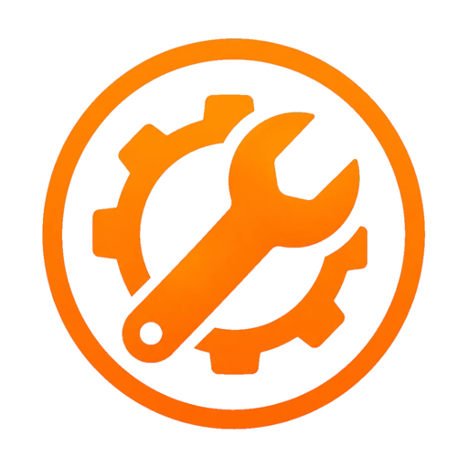
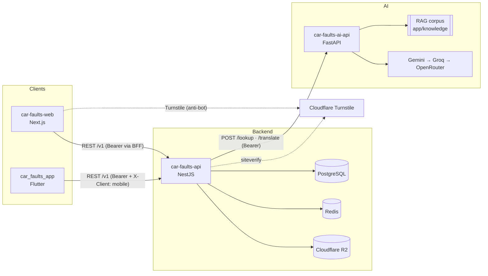

<p align="center">
  
</p>

<p align="center">
  
</p>

<h1 align="center">Auto Crónica</h1>

<p align="center">
  <strong>Chronic reliability by vehicle model.</strong><br>
  What typically fails on a given make / model / year / engine, how severe it is, what it costs, and how it gets fixed.
</p>

<p align="center">
  <a href="https://autocronica.autos">autocronica.autos</a> ·
  Android (Google Play) ·
  <code>pt-PT</code> · <code>en-GB</code> · <code>es-ES</code>
</p>

---

## The problem

People buying a used car, or who already own one, usually find out about the model's chronic faults too late. The information exists, but it's spread across forums, YouTube videos, ADAC/TÜV reports and Facebook groups, and rarely in a form that answers the question that matters:

> *"For this model, with this engine and from this year, what usually fails, at what mileage, how serious is it, and how much does the fix cost?"*

**Auto Crónica** puts that answer in one place. The user picks a vehicle and gets a structured list of known issues: severity, typical mileage, sources, step-by-step fixes with estimated cost, and community reviews and comments.

**What it is not:** it does not do VIN/plate history, odometer-fraud checks or accident records. That belongs to services like carVertical, Certidão Automóvel or IPO. The analysis here is **per model**, not per individual vehicle. All AI-generated content is labelled as such and is **indicative**: it does not replace a mechanic.

## The four systems

The platform is four independent repositories. The Nest backend is the only data entry point, and no client talks to the AI service directly.

| System | Role | Stack | Repository | Docs |
|---|---|---|---|---|
| **car-faults-api** | Core backend: catalog, lookup, auth, community, admin, caching | NestJS 11 · TypeORM · PostgreSQL 16 · Redis 7 · Cloudflare R2 | [GitHub](https://github.com/Daniel-Fonseca-da-Silva/car-faults-api) | [docs/02-car-faults-api.md](docs/02-car-faults-api.md) |
| **car-faults-ai-api** | Stateless AI microservice: generates and translates known issues | FastAPI · Pydantic · httpx · Gemini → Groq → OpenRouter · keyword RAG | [GitHub](https://github.com/Daniel-Fonseca-da-Silva/car-faults-ai-api) | [docs/03-car-faults-ai-api.md](docs/03-car-faults-ai-api.md) |
| **car-faults-web** | Public site with programmatic SEO, user area and admin panel | Next.js 16 (App Router) · React 19 · Tailwind 4 · shadcn/ui · next-intl | [GitHub](https://github.com/Daniel-Fonseca-da-Silva/car-faults-web) | [docs/04-car-faults-web.md](docs/04-car-faults-web.md) |
| **car_faults_app** | Mobile app (Android on Google Play; the Flutter project also supports iOS) | Flutter · Material 3 · Provider · Dio · AdMob | [GitHub](https://github.com/Daniel-Fonseca-da-Silva/car-faults-app) | [docs/05-car-faults-app.md](docs/05-car-faults-app.md) |



## The app at a glance

Screenshots of the Flutter app on a tablet, in `en-GB` and `pt-PT`.

<table>
  <tr>
    <td align="center" width="33%"><br><sub><b>Vehicle</b>: photo, garage/favorites, tech specs and a severity summary of known issues</sub></td>
    <td align="center" width="33%"><br><sub><b>Known issue</b>: description, sources, rating and a step-by-step fix with cost and votes</sub></td>
    <td align="center" width="33%"><br><sub><b>Fix and comments</b> (<code>pt-PT</code>): community comment with a photo</sub></td>
  </tr>
  <tr>
    <td align="center"><br><sub><b>Defects</b>: most-reported faults, with a label when the content falls back to another language</sub></td>
    <td align="center"><br><sub><b>Favorites</b>: saved models to compare</sub></td>
    <td align="center"><br><sub><b>About</b>: the problem, the solution and who is behind it</sub></td>
  </tr>
</table>

## Features

**For every visitor**
- Search by make, model, year, fuel type, engine and (optionally) number of doors.
- Vehicle page: tech specs, known issues, and a summary by severity (`low`, `medium`, `high`, `critical`).
- For each known issue: detailed description, typical mileage, sources, and fixes with steps and an estimated cost in euros.
- Read community reviews (1-5 stars) and comments.
- A defects hub you can browse by make → model → year → fuel → engine, with canonical, indexable URLs (web).
- Three languages: `pt-PT` (default), `en-GB` and `es-ES`.

**For signed-in users (Google login)**
- Rate known issues, comment (with an optional photo) and vote on fixes (👍/👎).
- **Garage**: save your own vehicles and see each one's known issues.
- **Favorites**: save models you're interested in.
- Report abusive comments or reviews.
- Profile with personal stats (searches, issues viewed, votes) and account deletion.

**For administrators (`role = admin`)**
- CRUD for vehicle models (with a catalog photo), known issues and fixes.
- Moderation queue for reports: mark as reviewed, dismiss, or remove the content.

## How a lookup works (summary)

The platform's central request is `GET /v1/lookups`. It goes through three levels before calling the AI, so most requests never reach an LLM:

1. **Redis**: a cached response for exactly those criteria and language.
2. **PostgreSQL**: the model is in the catalog and has known issues in the requested language.
3. **Translation**: the model has known issues in another language, and the AI translates them (cheaper and more consistent than generating again).
4. **Generation**: unknown vehicle; the AI generates known issues and fixes, which are saved in one transaction.

Before steps 3 and 4, the request has to pass the anti-abuse gate: **Cloudflare Turnstile** on the web, and a **per-IP rate limit in Redis** for the mobile app. Details in [docs/01-architecture.md](docs/01-architecture.md#the-lookup-flow).

## Documentation index

| # | Document | Contents |
|---|---|---|
| 01 | [Architecture](docs/01-architecture.md) | System view, main flows (lookup, login, upload), design decisions |
| 02 | [car-faults-api](docs/02-car-faults-api.md) | Nest modules, full endpoint reference, caching, pagination, rate limits |
| 03 | [car-faults-ai-api](docs/03-car-faults-ai-api.md) | HTTP contract, provider chain, prompts, RAG, output quality checks |
| 04 | [car-faults-web](docs/04-car-faults-web.md) | Routes, programmatic SEO, BFF, session, i18n, cookie consent, admin |
| 05 | [car_faults_app](docs/05-car-faults-app.md) | Flutter architecture, screens, mobile auth, AdMob/UMP, publishing |
| 06 | [Data model](docs/06-data-model.md) | ER diagram, tables, enums, partial unique indexes, migrations |
| 07 | [Security and privacy](docs/07-security.md) | Authentication, authorization, anti-abuse, secrets, GDPR |
| 08 | [Development, quality and deployment](docs/08-development-and-deployment.md) | End-to-end local setup, environment variables, CI, deployment |

## Quick start (full local environment)

The repositories reference each other by relative path, so clone them side by side.

```bash
# 0. Clone the four repositories next to each other
git clone https://github.com/Daniel-Fonseca-da-Silva/car-faults-api.git
git clone https://github.com/Daniel-Fonseca-da-Silva/car-faults-ai-api.git
git clone https://github.com/Daniel-Fonseca-da-Silva/car-faults-web.git
git clone https://github.com/Daniel-Fonseca-da-Silva/car-faults-app.git car_faults_app

# 1. AI service (stub mode, no LLM keys needed)
cd car-faults-ai-api
python -m venv venv && source venv/bin/activate
pip install -r requirements.txt -r requirements-dev.txt
cp .env.example .env            # AI_PROVIDER_MODE=stub, set API_KEY
uvicorn app.main:app --reload --port 8000

# 2. Backend (Postgres + Redis + API via Docker)
cd ../car-faults-api
cp .env.example .env            # AI_PROVIDER=http, AI_API_KEY = the AI service's API_KEY, TURNSTILE_ENABLED=false
docker compose up -d --build
docker compose exec api npm run migration:run

# 3. Web
cd ../car-faults-web
npm install && cp .env.example .env.local
npm run dev                     # http://localhost:3000

# 4. Mobile app
cd ../car_faults_app
flutter pub get && cp env/dev.example.json env/dev.json
flutter run --dart-define-from-file=env/dev.json
```

The full walkthrough, with every environment variable, is in [docs/08-development-and-deployment.md](docs/08-development-and-deployment.md).

## Quality

All four repositories follow the same rule: **lint + tests with at least 90% coverage** on every pull request and every push to `main` (GitHub Actions).

| Repository | Lint | Tests | Test files |
|---|---|---|---|
| car-faults-api | ESLint + Prettier | Jest (unit + e2e) | ~138 |
| car-faults-ai-api | Ruff + mypy + pip-audit | pytest | 13 modules / ~168 cases |
| car-faults-web | ESLint (next) | Jest + React Testing Library | ~156 |
| car_faults_app | `dart format` + `flutter analyze --fatal-infos` | flutter_test | ~106 |

## License

Proprietary, all rights reserved © 2026 Daniel Fonseca da Silva. See [LICENSE](LICENSE).
You may use and run the software. Modifying it or creating derivative works requires prior written permission.
