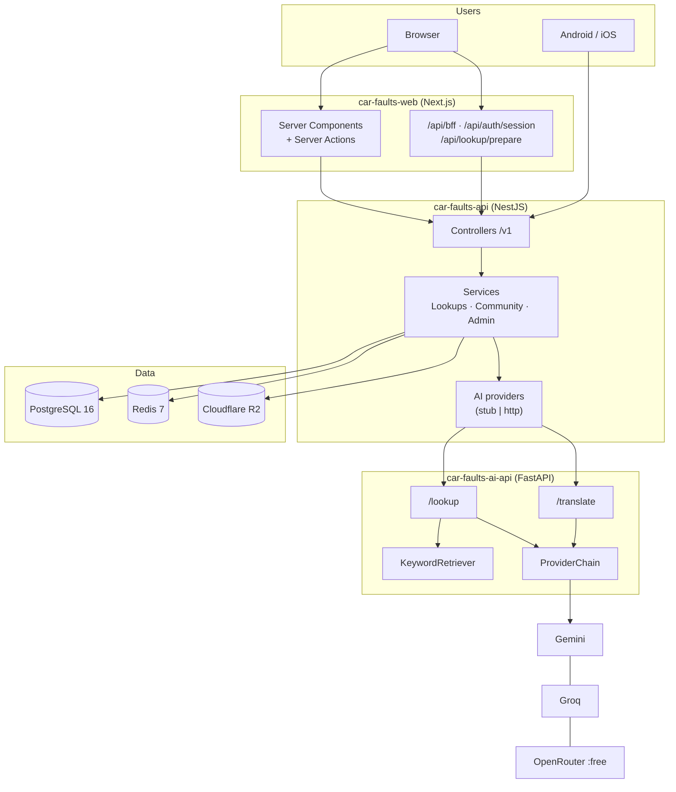
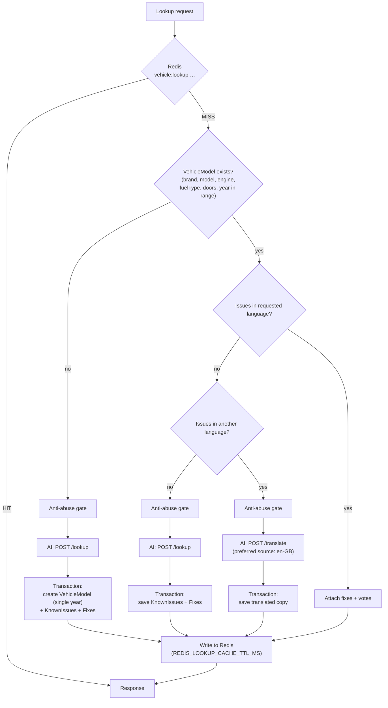
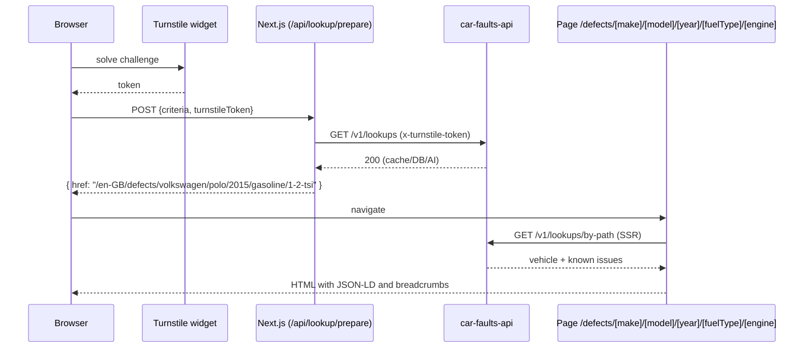
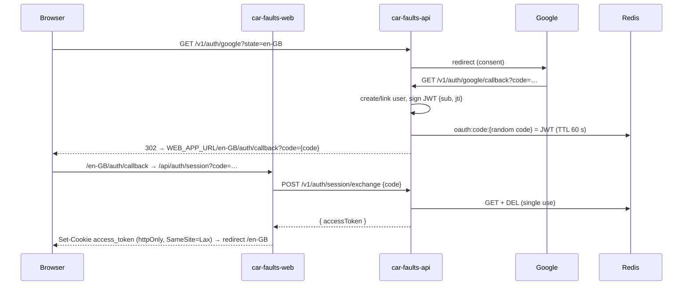
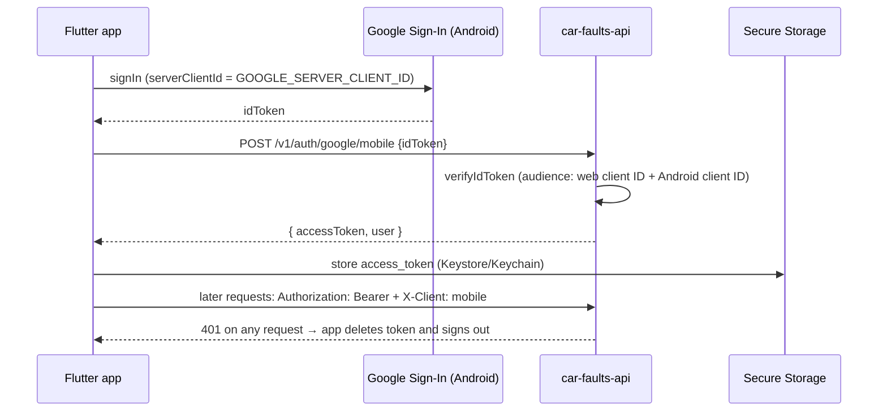

# 01 · Architecture

[← Back to README](../README.md)

This document explains how the four systems fit together, the most important end-to-end flows, and why the main design decisions were made.

- [System view](#system-view)
- [Boundaries and responsibilities](#boundaries-and-responsibilities)
- [The lookup flow](#the-lookup-flow)
- [Web: from search to canonical page](#web-from-search-to-canonical-page)
- [Authentication: web](#authentication-web)
- [Authentication: mobile app](#authentication-mobile-app)
- [Community: reviews, comments, votes and reports](#community)
- [Content internationalization](#content-internationalization)
- [Caching and invalidation](#caching-and-invalidation)
- [Architecture decisions](#architecture-decisions)

---

## System view

| Component | State | Where it runs (production) |
|---|---|---|
| car-faults-web | Stateless, SSR | Vercel (`autocronica.autos`) |
| car-faults-api | Stateless; state lives in Postgres/Redis | Distroless Docker container on a managed PaaS |
| PostgreSQL | Source of truth | Managed Postgres |
| Redis | Cache, rate limits, OAuth codes, JWT denylist | Managed Redis |
| Cloudflare R2 | Comment and catalog images | R2 bucket with a public domain |
| car-faults-ai-api | **Fully stateless** | Distroless Docker container |
| car_faults_app | Client | Google Play (Android) |

## Boundaries and responsibilities

The most important rule in the architecture: **only `car-faults-api` talks to `car-faults-ai-api`.** Clients never call the AI directly.

| Responsibility | Owner | Why |
|---|---|---|
| Persistence, catalog, users | car-faults-api | One source of truth for web and app |
| Authentication and authorization | car-faults-api | One JWT, valid for both clients |
| Deciding *when* to call the AI | car-faults-api | Cache/DB first; the AI is the last resort and the most expensive one |
| AI anti-abuse protection | car-faults-api | Turnstile (web) and rate limit (mobile), checked on the server |
| Prompts, providers, failover, RAG | car-faults-ai-api | Keep LLM SDKs and logic out of the business backend |
| SEO, sitemap, rendering | car-faults-web | Indexable page per vehicle |
| Ad consent (GDPR) | web and app | AdSense (web) / AdMob + UMP (app) |

## The lookup flow

`GET /v1/lookups?brand=…&model=…&year=…&engine=…&fuelType=…[&doors=…][&language=…]`

Key points (in `car-faults-api/src/lookups/lookups.service.ts`):

- **Year matching by range.** A `VehicleModel` has `yearFrom`/`yearTo`. The service first looks for an open-ended row (`yearTo IS NULL`, `yearFrom <= year`), then a closed range that contains the year. Models created by the AI start with `yearFrom = yearTo = year`, so repeating the exact same year hits the database. An admin can widen the range later.
- **`doors` is optional but part of the identity.** A 3-door and a 5-door Polo can be different entries.
- **The anti-abuse gate only applies on the AI path.** Cache and DB hits don't need Turnstile and don't use the mobile quota:
  - `X-Client: mobile` → `AiRateLimiterService`: a `throttle:ai:mobile:{ip}` counter in Redis (`INCR` + `PEXPIRE`), capped by `THROTTLE_AI_MOBILE_LIMIT`/`_TTL_MS`. If Redis fails, the request **is allowed** (fail-open), the same as the cache.
  - Any other client → `TurnstileService`: requires the `x-turnstile-token` header, checked against Cloudflare's `siteverify`. On failure → `403` with `code: "TURNSTILE_REQUIRED"`.
- **Translate instead of generate.** If the vehicle already has issues in another language, the API asks the AI service to translate them. That keeps the same set of issues across languages and is cheaper than a new generation.
- **Everything in one transaction.** Model, issues and fixes are saved atomically, so a failure halfway through never leaves a partial catalog entry.
- **Careful retry towards the AI** (`post-ai-with-retry.ts`): at most 2 attempts, only for network errors or **fast** `429/502/503/504` responses (< 5 s). A slow failure means the AI service has already gone through its own provider chain; retrying would just double 47-96 s of latency.
- **Activity.** With a session (optional guard), the search is logged in `activity_logs` (type `search`) without blocking the response.

### Lookup by path (read-only)

`GET /v1/lookups/by-path?make=…&model=…&year=…&fuelType=…&engine=…` resolves URL slugs to an existing `VehicleModel`. It **never triggers the AI** and doesn't need Turnstile: this is the endpoint public/indexed pages use. If the vehicle doesn't exist it returns `404`.

## Web: from search to canonical page

The web keeps the *expensive, protected* action (generate) separate from the *cheap, indexable* one (read):

The result: the first search for a vehicle "warms up" the catalog, and from then on the page lives at a stable URL that can be shared and is listed in `sitemap.xml`.

## Authentication: web

Login is Google OAuth2 driven by the backend, but the browser session lives in a cookie **on the web's domain**, not the API's.

From then on:

- **Server Components and Server Actions** use `serverApiFetch`, which reads the cookie and sends `Authorization: Bearer {jwt}` to the API.
- **Client Components** use `apiFetch`, which calls `/api/bff?path=/v1/…` (GET only). The BFF adds the Bearer on the server. The browser never sees the token.
- **Logout**: the API stores the `jti` in `jwt:deny:{jti}` in Redis until the token expires, and the web clears the cookie.

The single-use exchange code exists because the redirect from the API to the web can't safely carry the JWT in the URL (it would end up in logs and history). The code is valid for 60 s and can only be used once.

## Authentication: mobile app

The session is restored at startup (`AuthRepository.restoreSession`). A `401` from **any** authenticated repository triggers the same `onUnauthorized` callback, so the app never ends up "half signed in".

## Community

| Action | Endpoint | Rules |
|---|---|---|
| Rate an issue | `POST /v1/reviews` | 1 review per (user, issue), rating 1-5, optional comment |
| Comment | `POST /v1/comments` | Text + optional `imageUrl`, which **must** be a URL from the R2 bucket |
| Upload a photo | `POST /v1/storage/comment-images` | multipart, JPEG/PNG/WebP, max 5 MB, returns a public URL |
| Vote on a fix | `POST /v1/fixes/:id/vote` | `like`/`dislike`, 1 vote per (user, fix), can be changed or removed |
| Report | `POST /v1/reports` | On a comment or review; 1 report per user and content item |
| Moderate | `/v1/admin/reports` | Admin: `reviewed`/`dismissed`, or remove the content |

Image upload is a separate step: the client first uploads the file to R2 through the API, gets the URL back, and only then creates the comment. The `IsR2ImageUrl` validator stops anyone from injecting arbitrary external URLs.

**Fixes** are curated: generated by the AI (`source = ai`) or created by admins. Users vote on them but the clients don't let them submit new ones.

## Content internationalization

There are two levels of i18n:

1. **Interface**: message files (`messages/{locale}/*.json` on the web, `lib/l10n/*.arb` in the app).
2. **Content**: every `known_issue` has a `locale` column. The same vehicle can have its set of issues in `pt-PT`, `en-GB` and `es-ES`, generated or translated on demand (see the lookup flow).

For aggregated listings (`GET /v1/platform/faults`, the "most reported faults"), if the requested language has no content yet, the API falls back to the first language that does, in the order `pt-PT → en-GB → es-ES`, and returns `contentLocale` on each item so the client knows which language the text is in.

## Caching and invalidation

| Redis key | Contents | TTL |
|---|---|---|
| `vehicle:lookup:{brand}:{model}:{year}:{engine}[:doors][:fuel][:lang]` | Full lookup response | `REDIS_LOOKUP_CACHE_TTL_MS` |
| `user:{id}` | User (used by `JwtStrategy`) | `REDIS_USER_CACHE_TTL_MS` |
| `user:stats:{id}` | Profile stats | `REDIS_USER_STATS_CACHE_TTL_MS` |
| `platform:stats` | Home page totals | `REDIS_PLATFORM_CACHE_TTL_MS` |
| `platform:faults:{locale}:{limit}:{cursor}:{filters…}` | A page of most-reported faults | `REDIS_PLATFORM_CACHE_TTL_MS` |
| `oauth:code:{code}` | JWT waiting to be exchanged | 60 s |
| `jwt:deny:{jti}` | Revoked token (logout) | Until the token's `exp` |
| `throttle:ai:mobile:{ip}` | Count of AI calls from the app | `THROTTLE_AI_MOBILE_TTL_MS` |

**Invalidation.** When an admin changes a model, an issue or a fix, or a user votes on a fix, `buildLookupCacheKeysForVehicleModel` builds **every** possible lookup key for that model (each year in its range × with/without doors × with/without fuel type × each language) and deletes them. Changes show up immediately instead of waiting for the TTL.

**Redis failures never take requests down.** Cache reads and writes are wrapped in `try/catch` and logged as `warn`. The worst case is a trip to the database.

## Architecture decisions

| Decision | Rejected alternative | Reason |
|---|---|---|
| Separate AI service in Python | Calling LLMs directly from Nest | Isolates SDKs, versioned prompts and failover. The backend only knows a stable HTTP contract (`AiLookupResult`). |
| Chain of free-tier providers (Gemini → Groq → OpenRouter) | A single paid provider | Zero cost at this stage; one provider failing doesn't take the product down. |
| Cache → DB → AI | Always generating | Latency (the AI takes tens of seconds) and cost. Each vehicle is generated **once** per language. |
| Translate rather than generate for another language | Generating per language | Consistency across languages and fewer tokens. |
| Keyword RAG over files versioned in Git | Vector database | The corpus is small; it keeps the service stateless and auditable in Git. Phase 2 (embeddings) is planned. |
| Turnstile on the web, per-IP rate limit on the app | Turnstile on both | Turnstile is a browser widget; the app identifies itself with `X-Client: mobile` and has its own quota. |
| Token in a web-domain cookie + BFF | Cross-site cookie from the API | Avoids `SameSite=None` and third-party cookies; the JWT never reaches browser JavaScript. |
| Cursor (keyset) pagination | `page`/`offset` | Stable under concurrent inserts and efficient on large tables. |
| Soft delete + partial unique indexes | TypeORM `@Unique` | Lets users delete and re-create (e.g. review again) without breaking uniqueness. |
| Distroless nonroot Docker images | Full `slim` images | Minimal attack surface: no shell or package manager in production. |
| Stub forbidden in production | Silent fallback | Both services **refuse to start/respond** with fake AI in production. Invented content never reaches users. |
