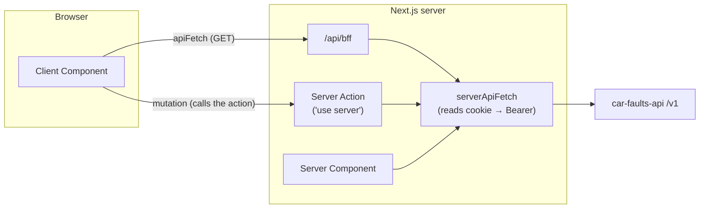

# 04 · car-faults-web (Next.js frontend)

[← Back to README](../README.md)

The public Auto Crónica site at [autocronica.autos](https://autocronica.autos). It has three jobs:

1. **SEO acquisition**: an indexable page per make, model, year, fuel type and engine.
2. **Product**: search, vehicle page, community, garage, favorites and profile.
3. **Back office**: admin panel for the catalog and moderation.

- [Stack](#stack)
- [Route map](#route-map)
- [How the web talks to the API](#how-the-web-talks-to-the-api)
- [Session and route protection](#session-and-route-protection)
- [Search with Turnstile](#search-with-turnstile)
- [Programmatic SEO](#programmatic-seo)
- [Internationalization](#internationalization)
- [Consent, ads and analytics](#consent-ads-and-analytics)
- [Code layout](#code-layout)
- [Configuration and scripts](#configuration-and-scripts)

---

## Stack

| Layer | Technology |
|---|---|
| Framework | Next.js 16 (App Router, Server Components, Server Actions) · React 19 |
| UI | Tailwind CSS 4 · shadcn/ui (Base UI) · lucide-react · sonner |
| i18n | next-intl 4 (locale prefix always required) |
| Anti-bot | Cloudflare Turnstile (widget) |
| Monetization | Google AdSense with Consent Mode v2 · donations (MB WAY, Wise, PIX via QR) |
| Analytics | Vercel Analytics, only after consent |
| Tests | Jest 29 + React Testing Library (coverage ≥ 90%) |
| Hosting | Vercel |

## Route map

Every page lives under `app/[locale]/`, with `locale ∈ {pt-PT, en-GB, es-ES}`.

| Route | Type | Description |
|---|---|---|
| `/` | Public | Hero, search form, platform stats, most-reported faults, ad slot |
| `/defects` | Public, indexable | Defects hub with filters (search params) and infinite scroll |
| `/defects/[make]` | Public, indexable | Hub per make |
| `/defects/[make]/[model]` | Public, indexable | Hub per model |
| `/defects/[make]/[model]/[year]` | Public, indexable | Hub per year |
| `/defects/[make]/[model]/[year]/[fuelType]/[engine]` | Public, indexable | **Vehicle page**: hero, specs, severity summary, accordion of issues with sources, fixes, reviews and comments |
| `/about` | Public | About the project and its founder |
| `/support` | Public | Support the project (MB WAY, Wise, PIX with a QR code generated on the client) |
| `/privacy` | Public | Privacy policy (also the URL declared on Google Play) |
| `/account-deletion` | Public | Account-deletion instructions (a Play Store requirement) |
| `/login` | Public | Google login |
| `/auth/callback` | Technical | Receives `?code=` and forwards to `/api/auth/session` |
| `/garage` | 🔐 | The user's vehicles and their known issues |
| `/favorites` | 🔐 | Favorite models |
| `/profile` | 🔐 | Account, stats, saved vehicles, danger zone (delete account) |
| `/admin` | 🛡️ | Dashboard |
| `/admin/vehicles`, `/admin/vehicles/new`, `/admin/vehicles/[id]` | 🛡️ | Model CRUD (with photo upload to R2) |
| `/admin/vehicles/[id]/issues/new`, `/admin/issues/[id]` | 🛡️ | Known-issue and fix CRUD |
| `/admin/reports` | 🛡️ | Moderation queue |
| `/[...rest]` | n/a | Any other path → localized `not-found` |

Route Handlers (outside the locale):

| Route | Purpose |
|---|---|
| `GET /api/bff?path=/v1/…` | Same-origin GET proxy to the API, adding the Bearer on the server. Only accepts paths starting with `/v1/` |
| `GET /api/auth/session?code=&locale=` | Exchanges the OAuth code for the JWT and sets the `access_token` cookie |
| `DELETE /api/auth/session` | Clears the cookie |
| `POST /api/lookup/prepare` | Runs the Turnstile-protected lookup and returns the canonical `href` |

Also: `sitemap.ts`, `robots.ts`, `opengraph-image.png`, icons.

## How the web talks to the API

There are three paths, all in `lib/api/`:



| Helper | Used in | Notes |
|---|---|---|
| `serverApiFetch(path, init)` | Server Components, Route Handlers, Server Actions | Reads the `access_token` cookie and sends `Authorization: Bearer`; `cache: "no-store"` |
| `apiFetch(path)` | Client Components (reads) | Calls `/api/bff?path=…` with `credentials: include` |
| Server Actions (`lib/api/comments.ts`, `reviews.ts`, `fixes.ts`, `storage.ts`, `reports.ts`, `account.ts`, `admin-*.ts`) | Mutations | Run on the server; the token is never exposed to client JavaScript |

`*.server.ts` modules are only imported from server code. Shared types live in `types/`.

## Session and route protection

- The session cookie is `access_token`: `httpOnly`, `SameSite=Lax`, `Secure` in production, with `maxAge` matching the JWT's `exp` (7-day fallback).
- **`proxy.ts`** (Next 16 middleware) does two things:
  1. Redirects any request to `profile|garage|admin|favorites` without the cookie to `/{locale}/login`.
  2. When the URL has no locale prefix, it ignores the `NEXT_LOCALE` cookie so the browser's `Accept-Language` wins again (so visitors don't get stuck in an old language).
- **Admin**: on top of the middleware, every `/admin` page calls `requireAdminUser()` on the server, which redirects if the user doesn't have `role = "admin"`. The API checks again with `AdminGuard` on every endpoint, so the web check is only for UX.
- The menus (`user-menu`, `mobile-nav`) only show the Admin entry to administrators.

The full login flow is in [01 · Architecture](01-architecture.md#authentication-web).

## Search with Turnstile

`components/home/vehicle-search-form.tsx`:

1. The user picks make/model (autocomplete from `lib/mocks/vehicle-makes.ts`), year, fuel type, engine and doors.
2. The `turnstile-widget` gets a token from Cloudflare.
3. `POST /api/lookup/prepare` calls `GET /v1/lookups` with `x-turnstile-token`, and API errors are mapped to stable codes (`TURNSTILE_REQUIRED`, `INVALID_CRITERIA`, `LOOKUP_UNAVAILABLE`, `LOOKUP_FAILED`) that the UI translates.
4. On success it gets the canonical `href` (`buildLookupHref`, using `slugify`) and navigates to the vehicle page, which is rendered on the server through `/v1/lookups/by-path`.

Why not render the result straight away? Because this way the final page is always the same one, at a stable URL that is indexable, shareable and cacheable, whether the visitor came from the search form or from Google.

## Programmatic SEO

| Technique | Implementation |
|---|---|
| One page per vehicle plus hierarchical hubs | `defects/[make]/…/[engine]` routes |
| Dynamic sitemap | `app/sitemap.ts`: static pages × locales + makes, models and vehicles from `GET /v1/platform/vehicles` (paged to the end). If the API fails, only the static pages are returned |
| hreflang | `lib/seo/build-hreflang.ts`: alternates for the 3 locales |
| Metadata | `lib/seo/build-page-metadata.ts`: title, description, canonical, Open Graph; `noIndex` for admin and private pages |
| Structured data (JSON-LD) | `WebSite` + `Organization` (home), `Vehicle` + `FAQPage` (issues as questions/answers) on the vehicle page, `BreadcrumbList` on the hubs |
| Visible breadcrumbs | `components/seo/page-breadcrumbs.tsx` |
| Images | `next/image` with `remotePatterns` built from `NEXT_PUBLIC_R2_PUBLIC_BASE_URL` |

## Internationalization

- `i18n/routing.ts`: `localePrefix: "always"`, `localeDetection: true`, default `pt-PT`.
- Messages in `messages/{locale}/{namespace}.json`, 15 namespaces: `about`, `account-deletion`, `admin`, `auth`, `common`, `faults`, `favorites`, `garage`, `home`, `nav`, `privacy`, `profile`, `search`, `seo`, `support`.
- `locale-switcher` with flags (`country-flag-icons`).
- The UI language is sent as `language` in lookups (`lib/lookup/map-lookup-language.ts`), so the **content** of known issues follows the chosen language.

## Consent, ads and analytics

- `cookie-consent-provider` + `cookie-consent-modal`: an **Accept/Reject** choice stored in the browser, which can be reopened from the footer (`cookie-settings-button`).
- **Google Consent Mode** starts as `denied`. Only after "Accept" does `applyGoogleConsent` grant it, and only then does the AdSense script load.
- An empty `NEXT_PUBLIC_ADSENSE_CLIENT_ID` turns ads off (dev/local).
- **Vercel Analytics** is only mounted with consent (`consent-gated-analytics`).

## Code layout

```
app/                 # routes (see the route map)
components/
  ui/                # shadcn primitives (API unchanged)
  header/ footer/ layout/ brand/
  home/              # hero, search form, stats
  faults/            # fault cards + infinite list
  vehicle/           # hero, specs, accordion, fixes, reviews, comments, report dialog, severity badge
  garage/ favorites/ profile/ support/ privacy/ about/
  admin/             # back-office forms and tables
  auth/ security/    # Google login, Turnstile widget
  ads/ analytics/ cookies/ seo/ lists/
lib/
  api/               # per-resource clients + server-client + client (BFF) + cursor
  seo/ lookup/ cookies/ ads/ pix/ qr/ faults/ garage/ favorites/ profile/ reviews/ sources/ …
  mocks/             # only the search form's autocomplete data (makes/models)
i18n/  messages/  types/  hooks/
proxy.ts             # middleware: route protection + locale
```

Convention: every component and every `lib/` module has its `*.test.ts(x)` next to it.

## Configuration and scripts

| Variable | Description |
|---|---|
| `NEXT_PUBLIC_API_URL` | car-faults-api base URL, no trailing slash |
| `NEXT_PUBLIC_SITE_URL` | Public URL (sitemap, canonical); production: `https://autocronica.autos` |
| `NEXT_PUBLIC_SITE_NAME` | Brand name (SEO, OG, JSON-LD) |
| `NEXT_PUBLIC_SITE_CONTACT_EMAIL` | Public contact email |
| `NEXT_PUBLIC_TURNSTILE_SITE_KEY` | Turnstile sitekey (verification only happens in the API) |
| `NEXT_PUBLIC_ADSENSE_CLIENT_ID` | AdSense publisher id; empty = no ads |
| `NEXT_PUBLIC_ADSENSE_HOME_SLOT` | Home ad slot; empty = hidden |
| `NEXT_PUBLIC_R2_PUBLIC_BASE_URL` | Same as the API's `R2_PUBLIC_BASE_URL` |

```bash
npm install
cp .env.example .env.local
npm run dev          # http://localhost:3000
npm run lint
npm run test:cov     # 90% gate (statements, branches, functions, lines)
npm run build
```

CI (GitHub Actions) runs `lint`, then `test:cov` + `build` on Node 24, on every PR and push to `main`.
