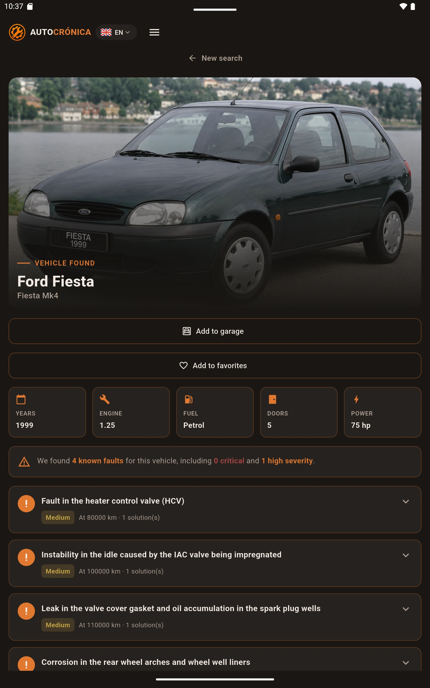
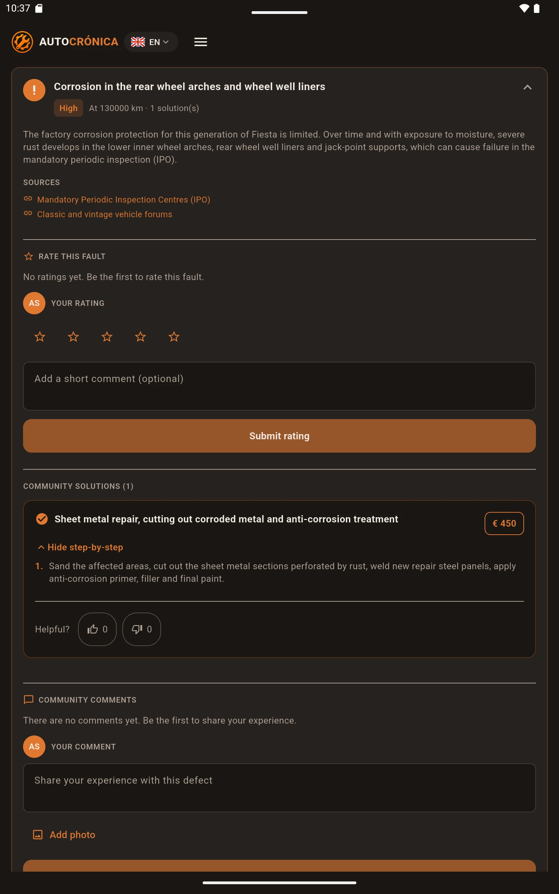
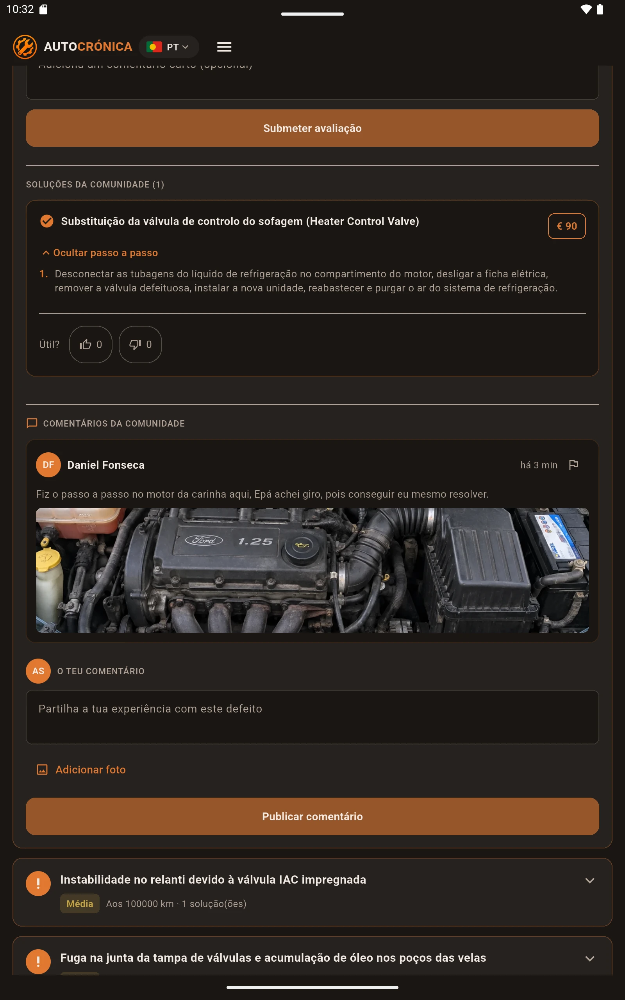
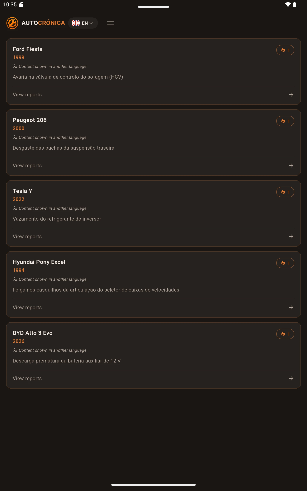
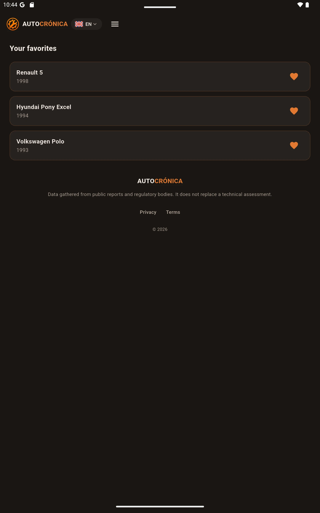
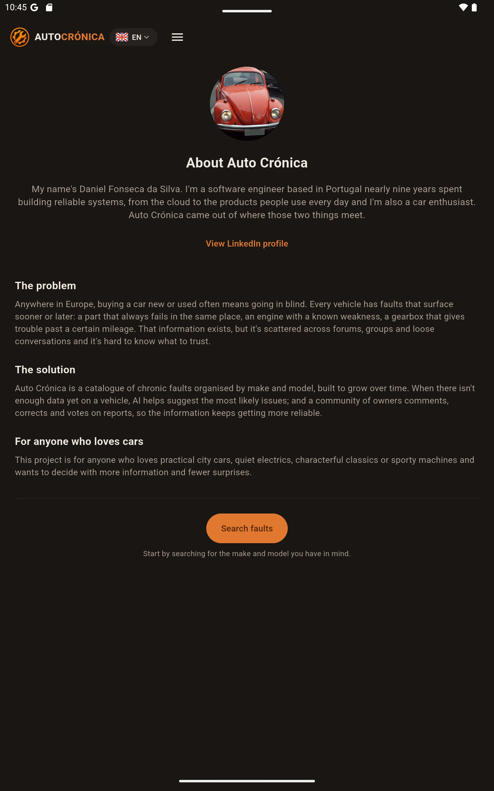
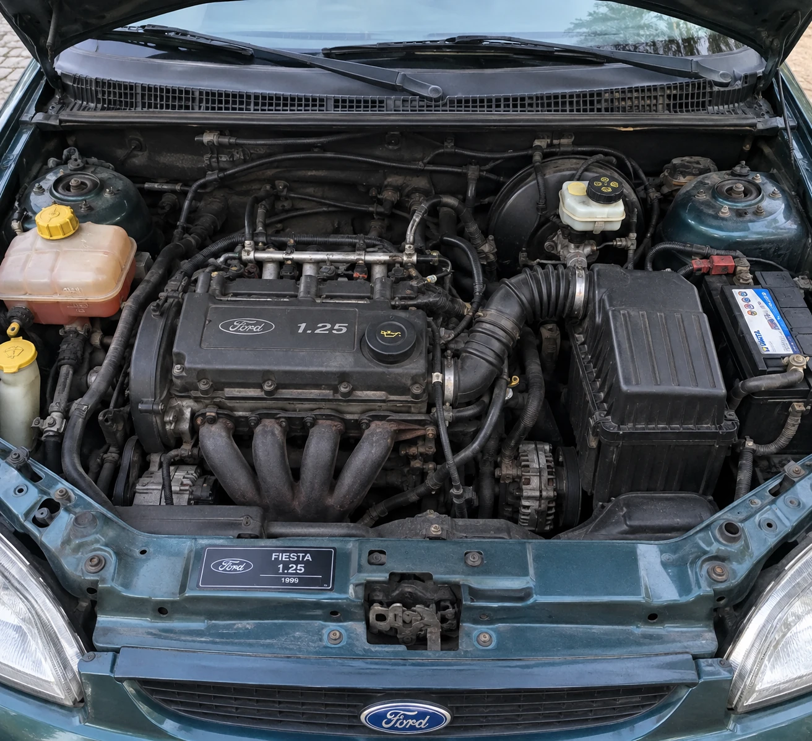

# 05 · car_faults_app (Flutter mobile app)

[← Back to README](../README.md)

The Auto Crónica mobile app: the same experience as the web, built for the phone of someone looking at a car at a dealership or in a listing. It is published on **Google Play** (`com.autocronica.carfaults`). The Flutter project also includes the iOS, web and desktop targets generated by the SDK, but Android is the production target.

- [Screens](#screens)
- [Stack](#stack)
- [Layered architecture](#layered-architecture)
- [Talking to the API](#talking-to-the-api)
- [Authentication](#authentication)
- [Features by screen](#features-by-screen)
- [Internationalization and theme](#internationalization-and-theme)
- [Ads and consent (GDPR)](#ads-and-consent-gdpr)
- [Configuration](#configuration)
- [Tests and quality](#tests-and-quality)
- [Publishing to the Play Store](#publishing-to-the-play-store)
- [Known limitations](#known-limitations)

---

## Screens

<table>
  <tr>
    <td align="center" width="33%"><br><sub>Vehicle page</sub></td>
    <td align="center" width="33%"><br><sub>Known issue, rating and fix</sub></td>
    <td align="center" width="33%"><br><sub>Fix and comments with a photo (<code>pt-PT</code>)</sub></td>
  </tr>
  <tr>
    <td align="center"><br><sub>Most-reported faults (language fallback)</sub></td>
    <td align="center"><br><sub>Favorites</sub></td>
    <td align="center"><br><sub>About</sub></td>
  </tr>
</table>

Example media: a catalog photo and a photo attached to a community comment (the one shown in the `pt-PT` screenshot above).

<table>
  <tr>
    <td align="center" width="50%"><br><sub>Catalog photo (BYD Atto 3)</sub></td>
    <td align="center" width="50%"><br><sub>Comment photo (Ford Fiesta 1.25, 1999)</sub></td>
  </tr>
</table>

## Stack

| Area | Package |
|---|---|
| SDK | Flutter 3.47 (stable) · Dart `^3.13` · Material 3 |
| State / DI | `provider` (`ChangeNotifier` + `MultiProvider`) |
| HTTP | `dio` |
| Login | `google_sign_in` 7 |
| Token | `flutter_secure_storage` (Android Keystore / iOS Keychain) |
| Preferences | `shared_preferences` (language) |
| Ads | `google_mobile_ads` (AdMob + UMP) |
| Media | `image_picker` (comment photos), `flutter_svg` |
| Other | `url_launcher`, `qr_flutter` (PIX donation), `intl` / `flutter_localizations` |
| Icons | `flutter_launcher_icons` (adaptive icon) |

## Layered architecture

It follows Flutter's recommended architecture: **UI → Domain → Data**, with the UI organized by feature and Data by type.

```
lib/
  main.dart                       # consent, session restore, dependency wiring
  data/
    services/                     # one class per HTTP resource + storage/config
      api_client.dart             #   Dio + interceptors (Bearer, X-Client, 401)
      api_config.dart             #   API_BASE_URL (dart-define)
      *_api_service.dart          #   auth, lookup, platform, fixes, reviews, comments, reports,
                                  #   storage, users, user_vehicles, activity_logs
      google_auth_service.dart  secure_token_storage.dart
      consent_service.dart  admob_config.dart
      locale_preferences_service.dart  legal_document_service.dart
    mappers/                      # JSON → domain models
    repositories/                 # API per use case; turn errors into domain failures
  domain/
    models/                       # immutable: KnownIssue, IssueFix, IssueReview, Comment,
                                  # LookupVehicle, SavedVehicle, FavoriteVehicle, TopFault, User, UserStats…
  l10n/                           # .arb (pt, en, es) + generated classes
  ui/
    core/                         # theme, colors, shared widgets, global view models
      view_models/                #   AuthSessionViewModel, LocaleViewModel
      utils/require_sign_in.dart  #   "sign in first, then continue the action" gate
    features/
      home/ lookup/ defects/ garage/ favorites/ profile/
      login/ about/ support/ legal/
        view_models/  views/  views/widgets/
```

Rules the code follows:

- **Views don't know about HTTP.** They call view models, which call repositories.
- **Repositories** wrap the services and expose domain results/failures (e.g. `LookupFailureReason.rateLimited | unavailable | notFound | unknown`, each with a translated message).
- **Wiring happens in `main.dart`.** A single `SecureTokenStorage` instance and a single `onUnauthorized` callback are shared by every authenticated repository. `CarFaultsApp` accepts any repository by injection, which makes widget tests easy.
- **Per-screen view models** are created with `ChangeNotifierProvider` at navigation time (`MaterialPageRoute`).

## Talking to the API

`buildApiDio()` (`data/services/api_client.dart`) builds the client used for every request:

| Interceptor | Behavior |
|---|---|
| `onRequest` | **Always** adds `X-Client: mobile`, plus `Authorization: Bearer {jwt}` when there's a token |
| `onError` | On `401`, deletes the token and calls `onUnauthorized`, which signs out across the whole app |

The `X-Client: mobile` header tells the API **not to require Turnstile** on the AI-generation path (there's no browser widget in a native app). In exchange, the API applies its own per-IP quota (`THROTTLE_AI_MOBILE_*`), which is only used when the AI actually runs. A `429` is shown to the user as "too many requests, try again later".

## Authentication

1. `GoogleAuthService.signIn()` uses `google_sign_in` with `serverClientId = GOOGLE_SERVER_CLIENT_ID` (the Google project's **web client ID**) to get an `idToken`.
2. `POST /v1/auth/google/mobile { idToken }` → `{ accessToken, user }`. The API accepts both the web and the Android client ID as audience.
3. The JWT is saved in secure storage, and `AuthSessionViewModel.setUser` updates the UI.
4. At startup, `AuthRepository.restoreSession()` reads the token and checks it with `GET /v1/users/me`; if that fails, the token is deleted.
5. **Actions that need a session** (save to garage, favorite, review, comment, vote, report) use `requireSignIn(context, action)`. If there's no session it opens the login screen and, if login succeeds, **runs the action the user originally tapped**, so they don't have to tap it again.
6. Logout: `POST /v1/auth/logout` (revokes the `jti`), Google sign-out, and the token is cleared. Both remote calls are best-effort; the local token is always cleared.

## Features by screen

| Screen | What it does | Endpoints |
|---|---|---|
| **Home** | Search (make and model with autocomplete, year from next year back to 1990, engine, fuel type, optional doors), platform stats, "most reported faults", AdMob banner | `GET /lookups`, `/platform/stats`, `/platform/faults` |
| **Results / Vehicle** | Hero with photo, "Add to garage", "Add to favorites", tech specs (years, engine, fuel, doors, power), summary "N known issues, X critical, Y high severity", expandable issue cards | `/user-vehicles/status`, `/activity-logs/favorites/:id` |
| **Expanded issue** | Description, typical mileage, clickable sources, reviews (stars + text), community fixes with step-by-step, cost and 👍/👎 votes, comments with photos, report | `/reviews`, `/fixes`, `/fixes/:id/vote`, `/comments`, `/storage/comment-images`, `/reports`, `POST /activity-logs` (`defect_consulted`) |
| **Defects** | Paginated list of most-reported faults with filters | `/platform/faults` |
| **Garage** | The user's vehicles and each one's issues; tapping opens the real lookup | `/user-vehicles`, `/lookups` |
| **Favorites** | Grid of favorite models; remove; open | `/activity-logs/favorites` |
| **Profile** | Google identity, account info, copyable ID, 5 stats, saved vehicles, **delete account** | `/users/me`, `/users/me/stats`, `DELETE /users/me` |
| **Sign in** | Google button + explanation of the benefits | `/auth/google/mobile` |
| **About / Support / Privacy** | Informational content; donations via MB WAY, Wise or PIX (QR); privacy policy loaded from `assets/legal/privacy_{lang}.json` | n/a |

Comment photos are picked with `image_picker` (quality 80), uploaded to `POST /v1/storage/comment-images`, and then referenced by the returned R2 URL in `POST /v1/comments`.

## Internationalization and theme

- **i18n**: `flutter gen-l10n` with `lib/l10n/app_pt.arb` as the template, plus `app_en.arb` and `app_es.arb`. `LocaleViewModel` + `LocaleRepository` save the choice in `shared_preferences`, and the chosen language is also sent as `language` in lookups, so the content of known issues follows the UI.
- **Theme**: a single dark theme (`AppTheme.dark`), matching the web colors:

| Token | Color | Use |
|---|---|---|
| `background` | `#1A1714` | Background |
| `surface` | `#272220` | Cards |
| `primary` | `#E07830` | Brand, actions |
| `onSurface` | `#F2EAE3` | Text |
| `muted` | `#B0A296` | Secondary text |
| `critical` | `#A64444` | Critical severity |
| `warning` | `#C4A444` | Medium severity |
| `success` | `#4CAF7D` | "Database online" indicator |

- **Responsive**: the same screens adapt to tablets (e.g. the tech-specs grid works out its column count from the available width).

## Ads and consent (GDPR)

Portugal is in the EEA, so consent comes **before** any ad:

1. At startup (Android only), `ConsentService.gatherConsent()` uses Google's **UMP SDK**: it requests the consent status and shows the form if needed.
2. Only if `canRequestAds()` is true does `MobileAds.instance.initialize()` run and `AdMobConfig.adsAllowed` become `true`.
3. The home banner only shows on Android, with consent, and in debug **or** with a real unit ID configured. Debug builds always use Google's official test banner.
4. Any consent or SDK failure is logged and ignored: **ads never block the app**.
5. `ADMOB_APP_ID` must match `com.google.android.gms.ads.APPLICATION_ID` in `AndroidManifest.xml`, which is the value the SDK reads.

## Configuration

Configuration comes in through `--dart-define-from-file`:

| Key | Description |
|---|---|
| `API_BASE_URL` | API URL. Android emulator: `http://10.0.2.2:{port}`; physical phone: your computer's LAN IP and API port |
| `GOOGLE_SERVER_CLIENT_ID` | Same as `GOOGLE_CLIENT_ID` in car-faults-api |
| `ADMOB_APP_ID` | AdMob app ID (Android) |
| `ADMOB_HOME_BANNER_ID` | Home banner unit (ignored in debug) |

Files: `env/dev.json` and `env/prod.json` (both gitignored), created from `env/*.example.json`. VS Code has a **car_faults_app (dev)** launch configuration.

```bash
flutter pub get
cp env/dev.example.json env/dev.json
flutter run --dart-define-from-file=env/dev.json

# Tablet emulator
$ANDROID_HOME/emulator/emulator -avd {tablet-avd} &
flutter run -d emulator-5554 --dart-define-from-file=env/dev.json

# Store screenshots
adb exec-out screencap -p > design/store/tablet/01-login-tablet-pt.png
```

## Tests and quality

About 106 test files mirror `lib/`: `test/data/{services,repositories,mappers}`, `test/domain/models`, `test/ui/{core,features}`.

```bash
dart format --output=none --set-exit-if-changed lib test tool
flutter analyze --fatal-infos
flutter test --coverage
dart run tool/check_coverage.dart      # fails below 90% line coverage (coverage/lcov.info)
```

CI (`.github/workflows/ci.yml`) runs exactly this in two jobs: `lint` and `test`.

## Publishing to the Play Store

```bash
cp env/prod.example.json env/prod.json            # production values
# android/key.properties set up (see android/key.properties.example)
flutter build appbundle --release --dart-define-from-file=env/prod.json
# → build/app/outputs/bundle/release/app-release.aab
```

- The release build uses a **separate** config file, so it can never ship with localhost values.
- Signed with the release keystore via `key.properties` (gitignored).
- Store assets in `design/store/`: `icon-512.png`, `feature-graphic.png` (1024×500), phone screenshots (`cellphone/`) and tablet screenshots (`tablet/`).
- **Privacy policy** (Play Console → *App content*): `https://autocronica.autos/pt-PT/privacy`.
- **Account deletion**: inside the app (Profile → danger zone) and on the web's public `/account-deletion` page, as Google Play requires.

## Known limitations

- The search form's make/model options are a fixed list (mirroring the web's `lib/mocks/vehicle-makes.ts`) until there's a catalog endpoint for autocomplete.
- `LookupDemoDisplay`, `GarageDemoDisplay` and `ProfileDemoDisplay` are still in the code as fallback data/fixtures from older screens. The real flows (garage, profile, favorites) already resolve vehicles through `GET /v1/lookups`.
- Ads only exist on Android; on iOS the banner is off.
