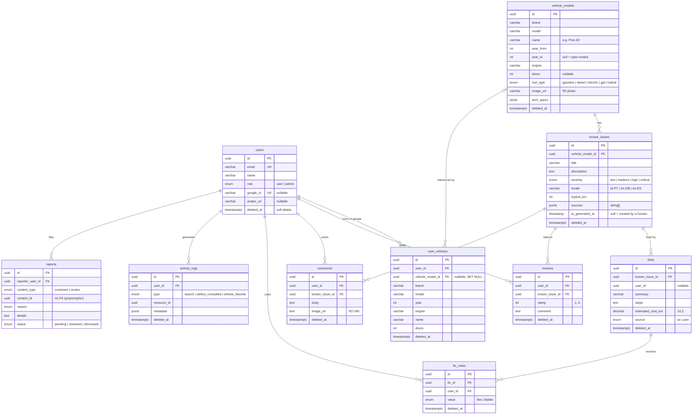

# 06 · Data model

[← Back to README](../README.md)

The PostgreSQL database belongs exclusively to `car-faults-api` and is managed with TypeORM migrations (`src/migrations/`). The other systems only see it through the API.

## ER diagram



Every table has `created_at` and `updated_at`, and every table except `reports` has `deleted_at` (soft delete).

## Tables

### `vehicle_models`: the catalog
One row is one vehicle **configuration**: make + model + engine + fuel type + doors, valid for a range of years.

- Rows created by the AI start with `year_from = year_to = {searched year}`. An admin can widen the range or leave it open (`year_to = NULL`) so one set of issues covers several years.
- `tech_specs` is free-form JSON (e.g. `{ "power_hp": 75 }`), shown as a grid on the vehicle page.
- `image_url` is only set by admins (`POST /v1/storage/vehicle-images`).

### `known_issues`: the known faults
- Belong to a model (`ON DELETE CASCADE`).
- **`locale`** lets the same vehicle be documented in several languages; each set is independent (generated or translated).
- A filled `ai_generated_at` means AI content, which the UI labels as such.
- `sources`: real `https://` URLs or short source names.

### `fixes` and `fix_votes`: fixes and votes
- `source = ai` (from the lookup) or `user` (created by a user, with `user_id`). Admins create/edit through `/v1/admin/fixes`.
- `estimated_cost_eur` is `DECIMAL(10,2)`, serialized as a string (`"90.00"`) so no precision is lost.
- One vote per user and fix; you can't vote on your own fix.

### `reviews` and `comments`: community
- `reviews.rating` has `CHECK (rating BETWEEN 1 AND 5)`, and there's one active review per user and issue.
- `comments.image_url` is validated by the API to belong to the R2 bucket.

### `user_vehicles`: the garage
- Can point at the catalog (`vehicle_model_id`) or just store brand/model/year/engine. If the model is deleted, the reference becomes `NULL` and the user's vehicle stays.

### `activity_logs`: activity and favorites
A generic event table that feeds the profile stats:

| `type` | When | `resource_id` | `metadata` |
|---|---|---|---|
| `search` | Lookup with a session | n/a | search criteria |
| `defect_consulted` | User opens an issue | issue id | n/a |
| `vehicle_favorite` | User favorites a model | model id | `{ year, … }` |

### `reports`: moderation
`content_id` is **polymorphic** (it points at `comments` or `reviews` depending on `content_type`), so it has no FK. Existence is checked by `ReportsService` at write time.

## Integrity: soft delete and partial unique indexes

A normal `UNIQUE` would, for example, stop a user from deleting a review and reviewing again, because the soft-deleted row is still there. So the uniqueness rules are **partial indexes** that ignore rows with `deleted_at` set:

| Index | Columns | Condition |
|---|---|---|
| `uq_user_vehicles_user_brand_model_year_engine` | `user_id, brand, model, year, engine` | `deleted_at IS NULL` |
| `uq_reviews_user_id_known_issue_id` | `user_id, known_issue_id` | `deleted_at IS NULL` |
| `uq_fix_votes_fix_id_user_id` | `fix_id, user_id` | `deleted_at IS NULL` |
| `uq_activity_logs_user_favorite_resource` | `user_id, resource_id, (metadata->>'year')` | `type = 'vehicle_favorite' AND deleted_at IS NULL` |
| `uq_reports_reporter_content` | `reporter_user_id, content_type, content_id` | None (regular constraint) |
| `idx_reports_content_type_content_id` | `content_type, content_id` | None (lookup index) |

The TypeORM entities deliberately don't declare `@Unique` on these tables, and each entity has a comment pointing to the migration responsible.

**Account deletion:** `DELETE /v1/users/me` doesn't delete the row. It anonymizes it (name, email, avatar and `google_id`) and soft-deletes it. Community content stays consistent and no identifiable personal data is left. Signing in again with the same Google account creates a new account, because the `google_id` was cleared.

## Migrations

| # | Migration | Effect |
|---|---|---|
| 01 | `CreateUsers` | Users |
| 02 | `AddDeletedAtToUsers` | User soft delete |
| 03 | `CreateVehicleModels` | Catalog |
| 04 | `CreateKnownIssues` | Known issues |
| 05 | `CreateFixes` | Fixes |
| 06 | `CreateUserVehicles` | Garage |
| 07 | `CreateReviews` | Reviews + 1-5 `CHECK` |
| 08 | `CreateComments` | Comments |
| 09 | `CreateFixVotes` | Votes |
| 10 | `AddFuelTypeToVehicleModels` | Fuel type becomes part of vehicle identity |
| 11 | `AddLocaleToKnownIssues` | Issues per language |
| 12 | `CreateActivityLogs` | Activity/favorites |
| 13 | `AddDeletedAtToSoftDeletableTables` | Soft delete everywhere |
| 14 | `AddImageUrlToComments` | Photos in comments |
| 15 | `AddRoleToUsers` | `user`/`admin` |
| 16 | `FixActivityLogsFavoriteUniqueIndex` | One favorite per year, ignoring deleted rows |
| 17 | `FixUserVehiclesUniqueIndex` | Partial uniqueness for the garage |
| 18 | `FixReviewsAndFixVotesUniqueIndex` | Partial uniqueness for reviews/votes |
| 19 | `CreateReports` | Reports |

```bash
npm run migration:run         # apply
npm run migration:revert      # revert the last one
npm run migration:generate -- src/migrations/MigrationName   # generate from the entities
```

TypeORM `synchronize` is off, and migrations **don't** run when the app starts: they are an explicit deployment step (see [08 · Development and deployment](08-development-and-deployment.md#running-migrations-in-production)).
