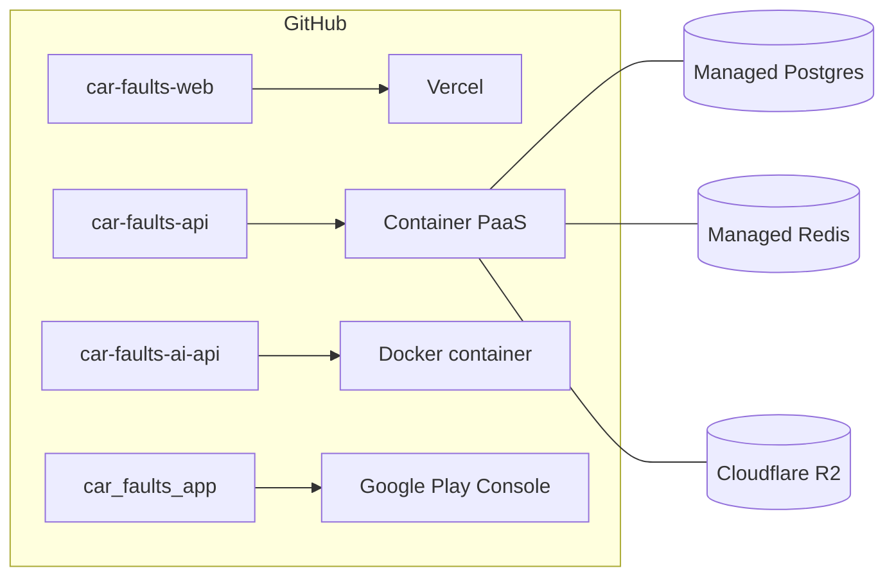

# 08 · Development, quality and deployment

[← Back to README](../README.md)

- [Prerequisites](#prerequisites)
- [Expected folder layout](#expected-folder-layout)
- [End-to-end local environment](#end-to-end-local-environment)
- [Shared variables map](#shared-variables-map)
- [Local ports and URLs](#local-ports-and-urls)
- [Quality: what runs before every PR](#quality-what-runs-before-every-pr)
- [Deployment](#deployment)
- [Troubleshooting](#troubleshooting)

> Every value below is a placeholder or a local-development example. Never commit real secrets; each repository's `.env.example` lists the variable names without values.

---

## Prerequisites

| Tool | Version | For |
|---|---|---|
| Node.js | 24 | car-faults-api, car-faults-web |
| Python | 3.11 | car-faults-ai-api |
| Docker + Compose | recent | Postgres/Redis (and optionally the API and AI) |
| Flutter SDK | 3.47 stable (Dart ^3.13) | car_faults_app |
| Android Studio / SDK | recent | Emulator and Android build |
| External accounts | n/a | Google Cloud (OAuth), Cloudflare (Turnstile + R2), LLM keys (optional in dev) |

## Expected folder layout

The repositories reference each other by relative path, so keep them side by side:

```
{workspace}/
  car-faults-project/     # this repository (documentation)
  car-faults-api/
  car-faults-ai-api/
  car-faults-web/
  car_faults_app/
```

## End-to-end local environment

### 1. car-faults-ai-api (port 8000)

```bash
cd car-faults-ai-api
python -m venv venv && source venv/bin/activate
pip install -r requirements.txt -r requirements-dev.txt
cp .env.example .env
```

Minimal `.env` for development:

```dotenv
APP_ENV=development
API_KEY={generate-a-random-string}
AI_PROVIDER_MODE=stub          # or "chain" with at least one key below
# GEMINI_API_KEY=
# GROQ_API_KEY=
# OPENROUTER_API_KEY=
RATE_LIMIT=60/minute
```

```bash
uvicorn app.main:app --reload --port 8000
curl http://localhost:8000/health
```

### 2. car-faults-api (port 3001 by default)

```bash
cd car-faults-api
npm install
cp .env.example .env
```

Key `.env` values for development:

```dotenv
NODE_ENV=development
PORT=3001
CORS_ORIGINS=http://localhost:3000

DATABASE_HOST=localhost      # the compose file overrides this to "postgres" inside the container
DATABASE_PORT=5432
DATABASE_USER={db-user}
DATABASE_PASSWORD={db-password}
DATABASE_NAME={db-name}
POSTGRES_USER={db-user}
POSTGRES_PASSWORD={db-password}
POSTGRES_DB={db-name}
POSTGRES_PORT=5432

REDIS_HOST=localhost
REDIS_PORT=6379
REDIS_USER_CACHE_TTL_MS=300000
REDIS_LOOKUP_CACHE_TTL_MS=86400000
REDIS_USER_STATS_CACHE_TTL_MS=60000
REDIS_PLATFORM_CACHE_TTL_MS=300000

JWT_SECRET={long-random-string}
GOOGLE_CLIENT_ID={web-oauth-client-id}
GOOGLE_CLIENT_SECRET={web-oauth-client-secret}
GOOGLE_CALLBACK_URL=http://localhost:3001/v1/auth/google/callback
GOOGLE_ANDROID_CLIENT_ID={android-oauth-client-id}
WEB_APP_URL=http://localhost:3000
COOKIE_SAME_SITE=lax
COOKIE_SECURE=false

AI_PROVIDER=http
AI_API_URL=http://localhost:8000/lookup          # from Docker: http://host.docker.internal:8000/lookup
AI_TRANSLATE_URL=http://localhost:8000/translate
AI_API_KEY={same-as-the-ai-service-API_KEY}

THROTTLE_TTL_MS=60000
THROTTLE_LIMIT=120
THROTTLE_AUTH_TTL_MS=60000
THROTTLE_AUTH_LIMIT=20
THROTTLE_LOOKUPS_TTL_MS=60000
THROTTLE_LOOKUPS_LIMIT=30
THROTTLE_AI_MOBILE_TTL_MS=3600000
THROTTLE_AI_MOBILE_LIMIT=20

TURNSTILE_ENABLED=false       # locally only; in production leave unset/true and set TURNSTILE_SECRET_KEY

R2_ACCOUNT_ID={r2-account-id}
R2_ACCESS_KEY_ID={r2-access-key}
R2_SECRET_ACCESS_KEY={r2-secret}
R2_BUCKET_NAME={bucket}
R2_PUBLIC_BASE_URL=https://{r2-public-domain}

HEALTH_MEMORY_HEAP_LIMIT_BYTES=314572800
```

> The numeric values above are reasonable development defaults, not the production ones.

Start it:

```bash
# Option A: everything in Docker (Postgres + Redis + API with hot reload)
docker compose up -d --build
docker compose exec api npm run migration:run
docker compose logs -f api

# Option B: only infrastructure in Docker, API on the host
docker compose up -d postgres redis
npm run migration:run
npm run start:dev
```

Check: `GET http://localhost:3001/v1/health` and Swagger at `http://localhost:3001/docs`.

**Making yourself admin locally**: sign in once, then:

```sql
UPDATE users SET role = 'admin' WHERE email = '{your-email}';
```

### 3. car-faults-web (port 3000)

```bash
cd car-faults-web
npm install
cp .env.example .env.local     # NEXT_PUBLIC_API_URL=http://localhost:3001
npm run dev
```

With `TURNSTILE_ENABLED=false` in the API, the widget can use [Cloudflare's test sitekey](https://developers.cloudflare.com/turnstile/troubleshooting/testing/).

### 4. car_faults_app

```bash
cd car_faults_app
flutter pub get
cp env/dev.example.json env/dev.json
```

```json
{
  "API_BASE_URL": "http://10.0.2.2:3001",
  "GOOGLE_SERVER_CLIENT_ID": "{same GOOGLE_CLIENT_ID as the API}",
  "ADMOB_APP_ID": "",
  "ADMOB_HOME_BANNER_ID": ""
}
```

```bash
flutter run --dart-define-from-file=env/dev.json
```

On a physical phone, use your computer's LAN IP in `API_BASE_URL`. Google sign-in needs the debug keystore's SHA-1 registered on the Android OAuth client.

## Shared variables map

Values that **must match** across systems:

| Value | car-faults-api | car-faults-ai-api | car-faults-web | car_faults_app |
|---|---|---|---|---|
| AI secret | `AI_API_KEY` | `API_KEY` | n/a | n/a |
| API URL | n/a | n/a | `NEXT_PUBLIC_API_URL` | `API_BASE_URL` |
| Web URL | `WEB_APP_URL`, `CORS_ORIGINS` | n/a | `NEXT_PUBLIC_SITE_URL` | n/a |
| Google client ID (web) | `GOOGLE_CLIENT_ID` | n/a | n/a | `GOOGLE_SERVER_CLIENT_ID` |
| Google client ID (Android) | `GOOGLE_ANDROID_CLIENT_ID` | n/a | n/a | (configured in Google Cloud) |
| R2 public domain | `R2_PUBLIC_BASE_URL` | n/a | `NEXT_PUBLIC_R2_PUBLIC_BASE_URL` | n/a |
| Turnstile | `TURNSTILE_SECRET_KEY` | n/a | `NEXT_PUBLIC_TURNSTILE_SITE_KEY` | n/a |

## Local ports and URLs

| Service | URL |
|---|---|
| Web | http://localhost:3000 |
| API | http://localhost:3001/v1 (or whatever `PORT` is set to) |
| API Swagger | http://localhost:3001/docs · JSON at `/docs-json` |
| API health | http://localhost:3001/v1/health |
| AI | http://localhost:8000 · `/docs` · `/redoc` · `/health` |
| Postgres | localhost:5432 |
| Redis | localhost:6379 |

## Quality: what runs before every PR

All four repositories run GitHub Actions on every `pull_request` and every `push` to `main`, with **at least 90% coverage**:

| Repository | `lint` job | `test` job | Extra |
|---|---|---|---|
| car-faults-api | `npm run lint` (ESLint + Prettier) | `npm run test:cov` + `npm run build` | n/a |
| car-faults-ai-api | `ruff check`, `ruff format --check`, `mypy app` | `pytest --cov-fail-under=90` | `audit` job: `pip-audit` |
| car-faults-web | `npm run lint` | `npm run test:cov` + `npm run build` | n/a |
| car_faults_app | `dart format --set-exit-if-changed`, `flutter analyze --fatal-infos` | `flutter test --coverage` + `tool/check_coverage.dart` | n/a |

Equivalent local commands:

```bash
# API
npm run lint && npm run test:cov
# AI
ruff check app tests && ruff format --check app tests && mypy app && make test-coverage
# Web
npm run lint && npm run test:cov && npm run build
# App
dart format --output=none --set-exit-if-changed lib test tool && flutter analyze --fatal-infos \
  && flutter test --coverage && dart run tool/check_coverage.dart
```

**Working conventions**: one branch per feature (`feat/…`, `feature/…`, `fix/…`), Conventional Commits (`feat:`, `fix:`, `test:`), PR into `main` with green CI.

## Deployment



### car-faults-api

- Multi-stage image → `gcr.io/distroless/nodejs24-debian13:nonroot`, `EXPOSE 3001`, `CMD dist/main.js`.
- In production: `NODE_ENV=production`, `AI_PROVIDER=http`, `COOKIE_SECURE=true`, `TURNSTILE_SECRET_KEY` set, and `REDIS_USER`/`REDIS_PASSWORD` when Redis requires AUTH.
- The image contains no migration tooling and no shell, so migrations are a separate step.

#### Running migrations in production

Migrations run from a machine that can reach the production database, typically through the hosting provider's database tunnel. With the Railway CLI, for example:

```bash
# Terminal 1: open a tunnel to Postgres (note the local port it prints)
railway connect Postgres --tunnel-only --ssh

# Terminal 2: run the migrations through the tunnel
railway run --service car-faults-api bash -c \
  'DATABASE_HOST=127.0.0.1 DATABASE_PORT={tunnel-port} npm run migration:run'
```

Recommended order for a release with migrations: **migrations first, then the new API version** (migrations are additive).

### car-faults-ai-api

```bash
docker build -t car-faults-ai-api .
docker run --rm -p 8000:8000 --env-file .env car-faults-ai-api
```

- `APP_ENV=production`, `AI_PROVIDER_MODE=chain`, at least one provider key, a strong `API_KEY`, and `REDIS_URL` if there's more than one instance.
- No Postgres/Redis needed. The image's `HEALTHCHECK` calls `/health` with `urllib`.
- It should be reachable **only** by car-faults-api (private network or, at minimum, Bearer + rate limit).

### car-faults-web

- Vercel, with the `NEXT_PUBLIC_*` variables set on the project. `NEXT_PUBLIC_SITE_URL=https://autocronica.autos`.
- `sitemap.xml` is generated from the API catalog at request time.

### car_faults_app

```bash
cp env/prod.example.json env/prod.json
flutter build appbundle --release --dart-define-from-file=env/prod.json
# upload build/app/outputs/bundle/release/app-release.aab in the Play Console
```

Play Console checklist: privacy policy `https://autocronica.autos/pt-PT/privacy`, account-deletion URL `/account-deletion`, a data-safety form consistent with the [privacy section](07-security.md#privacy-and-gdpr), the ads declaration (AdMob), and the store graphics in `design/store/` (512 icon, feature graphic, phone and tablet screenshots).

Before every release, bump `version:` in `pubspec.yaml` (`x.y.z+build`); the `build` number must always go up.

## Troubleshooting

| Symptom | Likely cause | Fix |
|---|---|---|
| API won't start: `AI_PROVIDER must be "http" in production` | `NODE_ENV=production` with the stub | `AI_PROVIDER=http` + the AI URLs |
| Lookup returns `503` | AI unreachable or every provider failed | Check the AI service's `/health` and the `ai_lookup_provider_failed` logs |
| API in Docker can't reach the AI | `localhost` points at the container itself | `http://host.docker.internal:8000/...` (the compose file already has `extra_hosts`) |
| Web: `403 TURNSTILE_REQUIRED` | Missing/expired token, or mismatched sitekey/secret | Check the sitekey/secret pair; locally use `TURNSTILE_ENABLED=false` |
| App: `429` when searching | Mobile AI quota used up | Raise `THROTTLE_AI_MOBILE_LIMIT` in dev or wait for the TTL |
| App in the emulator can't reach the API | `localhost` in the emulator is the emulator itself | `http://10.0.2.2:{port}` |
| Google sign-in in the app fails with error 10 | SHA-1 not registered or wrong client ID | Register the SHA-1 on the Android client; `GOOGLE_SERVER_CLIENT_ID` = the **web** client |
| R2 images don't show on the web | Domain not allowed in `next/image` | `NEXT_PUBLIC_R2_PUBLIC_BASE_URL` equal to `R2_PUBLIC_BASE_URL`, then rebuild |
| Comment with image rejected (`400`) | URL outside the R2 bucket | Upload to `/v1/storage/comment-images` first and use the returned URL |
| Admin changes don't show up | n/a | Shouldn't happen: writes invalidate the cache. If it does, check the Redis connection in the logs |
